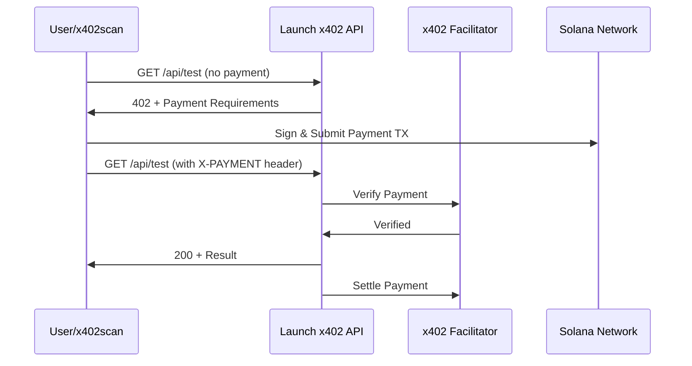

# x402scan Integration Guide

This document provides specific instructions for listing the Launch x402 Test API on x402scan.

## Endpoint Information

### Base URL
- **Development**: `http://localhost:3000`
- **Production**: `https://yourdomain.com` (replace with your actual domain)

### Endpoints

#### 1. GET `/api/test`
```
URL: https://yourdomain.com/api/test
Method: GET
Cost: $1.00 USDC
Network: solana-devnet (or solana for mainnet)
```

#### 2. POST `/api/test`
```
URL: https://yourdomain.com/api/test
Method: POST
Cost: $2.50 USDC
Network: solana-devnet (or solana for mainnet)
```

## x402 Response Schema

When a request is made without payment, the endpoint returns a 402 response following the x402scan validation schema:

```json
{
  "x402Version": 1,
  "accepts": [
    {
      "scheme": "exact",
      "network": "solana-devnet",
      "maxAmountRequired": "1000000",
      "resource": "https://yourdomain.com/api/test",
      "description": "Test API Request - x402scan Demo",
      "mimeType": "application/json",
      "payTo": "YOUR_TREASURY_ADDRESS",
      "maxTimeoutSeconds": 300,
      "asset": "4zMMC9srt5Ri5X14GAgXhaHii3GnPAEERYPJgZJDncDU",
      "outputSchema": {
        "input": {
          "type": "http",
          "method": "GET",
          "queryParams": {
            "message": {
              "type": "string",
              "required": false,
              "description": "Optional message to include in response"
            }
          }
        },
        "output": {
          "type": "object",
          "properties": {
            "success": { "type": "boolean" },
            "message": { "type": "string" },
            "timestamp": { "type": "number" },
            "network": { "type": "string" },
            "paid": { "type": "boolean" }
          }
        }
      }
    }
  ]
}
```

## Listing on x402scan

### Prerequisites

1. **Deploy your API**: Make sure your API is deployed and accessible via HTTPS
2. **Set Environment Variables**: Configure all required environment variables
3. **Test the Endpoint**: Verify the endpoint works correctly
4. **Have USDC in Treasury Wallet**: Ensure your treasury wallet can receive payments

### Step-by-Step Listing Process

1. **Visit x402scan**
   - Go to [x402scan.com](https://x402scan.com)
   - Navigate to "Add Resource" or "Submit API"

2. **Provide API Details**
   ```
   Name: Launch x402 Test API
   Description: Demo endpoint for testing x402 payment protocol on Solana
   Category: Testing / Demo
   Provider: Launch x402
   ```

3. **Add Endpoint URLs**
   ```
   GET Endpoint: https://yourdomain.com/api/test
   POST Endpoint: https://yourdomain.com/api/test
   ```

4. **Network Configuration**
   ```
   Network: solana-devnet (for testing) or solana (for production)
   Payment Token: USDC
   Treasury Address: YOUR_TREASURY_WALLET_ADDRESS
   ```

5. **Pricing Information**
   ```
   GET Request: $1.00 USDC (1000000 micro-units)
   POST Request: $2.50 USDC (2500000 micro-units)
   ```

6. **Schema Validation**
   - x402scan will automatically fetch your 402 response
   - Verify that your response matches the required schema
   - Ensure all required fields are present

7. **Test the Integration**
   - x402scan may perform test requests to validate functionality
   - Ensure your treasury wallet is correctly configured
   - Verify payment flow works end-to-end

### Validation Checklist

Before submitting to x402scan, verify:

- [ ] API is deployed and accessible via HTTPS
- [ ] Returns proper 402 response without payment
- [ ] Payment header is correctly extracted and verified
- [ ] Response includes all required schema fields
- [ ] `scheme` is set to "exact"
- [ ] `network` matches your configuration (solana-devnet or solana)
- [ ] `maxAmountRequired` is specified in micro-units (6 decimals for USDC)
- [ ] `resource` is a full URL with protocol
- [ ] `asset` contains the correct USDC mint address
- [ ] `outputSchema` is properly defined
- [ ] CORS headers allow cross-origin requests
- [ ] Treasury wallet address is valid and monitored
- [ ] Payment settlement works correctly

### Testing Your Listing

Once listed on x402scan, test the integration:

1. **Find Your API**: Search for "Launch x402" on x402scan
2. **View Details**: Check that all information is displayed correctly
3. **Test GET Endpoint**: Use x402scan's built-in tester
4. **Test POST Endpoint**: Try different actions (echo, process, analyze)
5. **Verify Payments**: Confirm USDC payments arrive in treasury wallet
6. **Check Analytics**: Monitor request counts and payment totals

## Troubleshooting

### Common Issues

#### 1. 402 Response Not Recognized
- Verify your response matches the x402scan schema exactly
- Check that `x402Version` is set to 1
- Ensure `accepts` is an array

#### 2. Payment Verification Fails
- Confirm `FACILITATOR_URL` is correct
- Check treasury wallet address is valid
- Verify network matches (devnet vs mainnet)

#### 3. CORS Errors
- Ensure CORS headers are set correctly
- Allow `X-PAYMENT` header in CORS configuration
- Verify `Access-Control-Allow-Origin` includes x402scan domain

#### 4. Schema Validation Errors
- Double-check field types in `outputSchema`
- Ensure all required fields are present
- Validate JSON structure

#### 5. Resource URL Invalid
- Must be full URL with protocol (https://)
- Should match deployment domain
- Verify path is correct (/api/test)

### Getting Help

- Review the [x402scan documentation](https://x402scan.com/docs)
- Check the [x402-solana package docs](https://www.npmjs.com/package/@payai/x402-solana)
- Test locally first using the example client
- Verify environment variables are set correctly

## Monitoring and Maintenance

After listing on x402scan:

### Monitor Treasury Wallet
```bash
# Check USDC balance
solana-keygen pubkey treasury.json
# View transactions
solana transaction-history <treasury-address>
```

### Track API Usage
- Implement logging for all requests
- Monitor 402 responses vs. successful payments
- Track different endpoint usage (GET vs POST)

### Update Pricing
If you need to change pricing:
1. Update the `amount` in `createPaymentRequirements()`
2. Redeploy your API
3. Update listing on x402scan if required

### Network Migration
To move from devnet to mainnet:
1. Update `NEXT_PUBLIC_NETWORK=solana`
2. Change USDC mint to mainnet address
3. Update treasury wallet to mainnet wallet
4. Redeploy and update x402scan listing

## Example Integration Flow



## Additional Resources

- [API Documentation](./README.md)
- [Example Client](./example-client.ts)
- [Type Definitions](./types.ts)
- [Main Project README](../../../README.md)

---

For questions specific to x402scan listing, contact the x402scan team or refer to their documentation.

